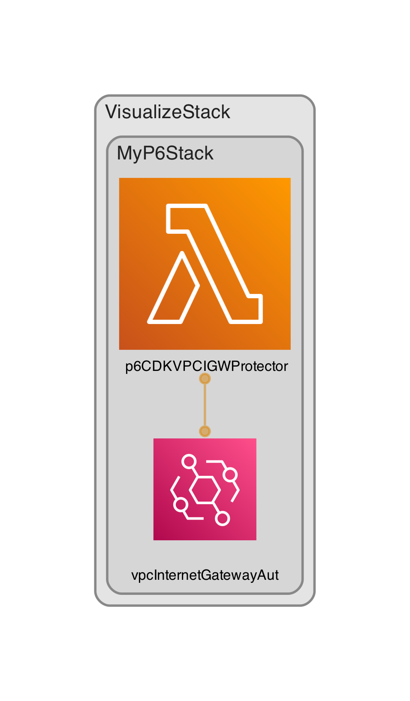

AWS CDK: Real-Time removes un approved IGW

# P6CDKVPCIGWProtector

## LICENSE

[](https://opensource.org/licenses/Apache-2.0)

## Other

  

## Usage

```ts
...
import { P6CDKVPCIGWProtector } from 'p6-cdk-vpc-igw-protector'

new P6CDKVPCIGWProtector(this, 'P6CDKVPCIGWProtector', {
});
```

## Architecture



## Author

Philip M. Gollucci <pgollucci@p6m7g8.com>
